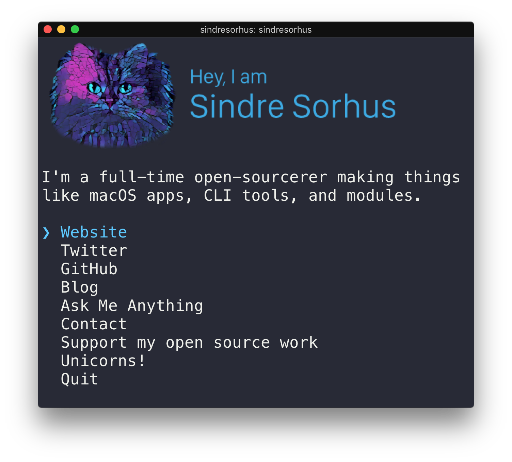

# kmdkuk [](https://travis-ci.org/kmdkuk/kmdkuk)

> The kmdkuk CLI




## Usage

Install Node.js, then:

```
$ npx kmdkuk
```


## Built with

- [ink](https://github.com/vadimdemedes/ink) - React for interactive command-line apps
- [terminal-image](https://github.com/sindresorhus/terminal-image) - Display images in the terminal


## License

MIT © [Sindre Sorhus](https://sindresorhus.com)
